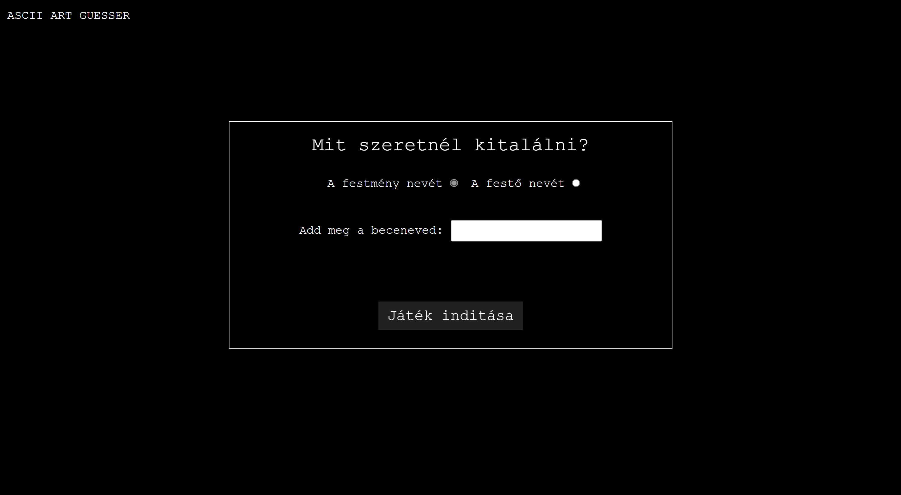
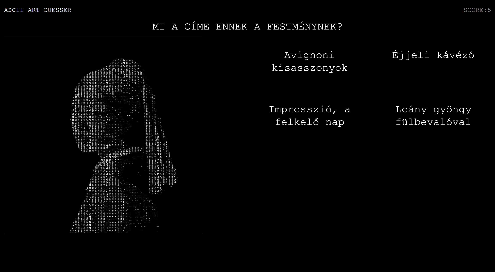
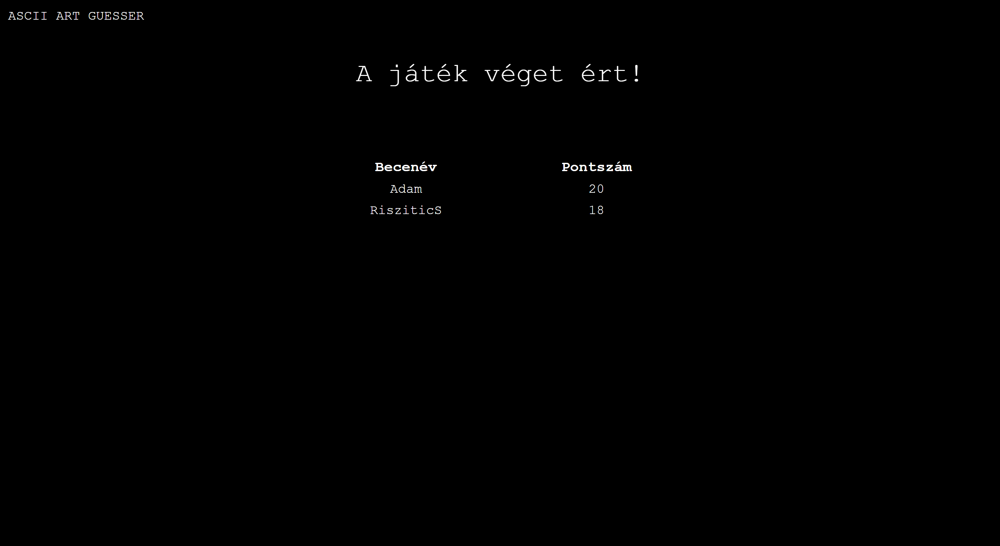

# 🎨 ASCII ArtGuesser - Művészeti Találgató Játék

## 📖 Bevezetés

Az **ASCII ArtGuesser** egy interaktív játék, amelynek célja, hogy a játékosok művészeti alkotásokat azonosítsanak be, amik ASCII karakterek által jelennek meg. A játékosok különböző festményeket látnak, és ki kell találniuk, hogy ki alkotta azokat.

## 🚀 Fő funkciók

- 🎭 **Játékmenet:** Különböző festmények megjelenítése, amelyeket a játékosnak be kell azonosítania.
- 🏆 **Pontozás:** A helyes válaszok alapján a játékos pontokat kap.
- 📊 **Leaderboard:** A legjobb játékosok eredményeit rangsoroló tábla.
- 📱 **Reszponzív dizájn:** A játék asztali és mobil eszközökön egyaránt játszható.

## ⚙️ Telepítés és futtatás

1. **🔧 Szerver beállítása:** Telepíts XAMPP vagy WAMP szervert, majd indítsd el az **Apache** és **MySQL** szolgáltatásokat.
2. **💾 Adatbázis létrehozása:** Nyisd meg a phpMyAdmin felületet és hozz létre egy **artguesser** nevű adatbázist.
3. **📥 Adatbázis importálása:** Importáld a `artguesser.sql` fájlt az adatbázisba.
4. **🔍 Konfiguráció:** A `db-connect.php` fájlban állítsd be az alábbi adatokat:
   ```php
   $host = 'localhost';
   $username = 'root';
   $password = '';
   $db_name = 'artguesser';
   ```
5. **🚀 Futtatás:** Nyisd meg a böngésződben: `http://localhost/artguesser`

## 🛠️ Használt technológiák

- 🎨 **Frontend:** HTML, CSS, JavaScript, p5.js
- 🖥️ **Backend:** PHP, MySQL
- 🎨 **Stílus:** Reszponzív webdizájn (CSS Media Queries)

## 📌 Menü



## 🎮 Játék



## 🏆 Pontszámok



## 🔮 Fejlesztési lehetőségek

- 🖼️ **Több festmény és művész** hozzáadása az adatbázishoz.
- 🎮 **Nehezebb játékmódok** bevezetése.

## 👨‍💻 Fejlesztők

- **Risztics**

